<h1 align="center">基于SpringBoot+Vue的流浪动物管理系统【带论文】</h1>

- <b>完整代码获取地址：从戎源码网 ([https://armycodes.com/](https://armycodes.com/))</b>
- <b>技术探讨、资料分享，请加QQ群：692619798</b>
- <b>作者微信：19941326836  QQ：3645296857</b>
- <b>承接计算机毕业设计、Java毕业设计、Python毕业设计、深度学习、机器学习</b>
- <b>选题+开题报告+任务书+程序定制+安装调试+论文+答辩ppt 一条龙服务</b>
- <b>所有选题地址 ([https://github.com/Descartes007/allProject](https://github.com/Descartes007/allProject)) </b>

## 一、项目介绍

基于SpringBoot+Vue的流浪动物管理系统，系统角色为管理员、志愿者、普通用户，主要功能如下
### 管理员：
- 基本操作：登录、修改密码、获取个人信息、修改个人信息
- 流浪动物管理：筛选动物、获取动物列表、查看动物详情、新增动物、删除动物、修改动物信息、上传/更新图片、设置领养/寄养状态
- 领养申请管理：获取领养申请列表、筛选申请、查看申请详情、删除申请、修改申请信息、变更处理状态
- 领养审核管理：获取审核列表、审批通过/驳回、查看审核记录、修改审核结果、删除审核记录
- 动物寄养管理：获取寄养列表、筛选寄养、查看寄养详情、新增寄养信息、修改寄养信息、删除寄养信息、审批寄养（是否通过）
- 收藏管理：查看收藏列表、筛选收藏、删除收藏、查看收藏详情
- 留言管理：获取留言列表、筛选留言、查看留言详情、回复留言、删除留言
- 新闻资讯管理：发布新闻、获取新闻列表、筛选新闻、查看新闻详情、修改新闻、删除新闻
- 论坛管理：发布帖子、获取帖子列表、筛选帖子、查看帖子详情、审核帖子状态、删除帖子
- 管理员账号管理：新增管理员、获取管理员列表、筛选管理员、查看管理员详情、修改管理员信息、删除管理员
- 普通用户管理：新增用户、获取用户列表、筛选用户、查看用户详情、修改用户信息、删除用户
- 志愿者管理：新增志愿者、获取志愿者列表、筛选志愿者、查看志愿者详情、修改志愿者信息、删除志愿者
### 志愿者：
- 基本操作：登录、修改密码、获取个人信息、修改个人信息
- 流浪动物浏览：筛选动物、获取动物列表、查看动物详情
- 动物寄养：提交寄养申请、查看寄养申请列表、查看申请详情、修改/撤销申请
- 动物领养：提交领养申请、查看申请进度、查看申请详情、修改/撤销申请
- 收藏管理：收藏/取消收藏、查看收藏列表、查看收藏详情
- 留言互动：发布留言、查看留言列表、查看留言详情、删除本人留言
- 论坛互动：发布帖子、查看帖子列表、查看帖子详情、评论互动、删除本人帖子
### 普通用户：
- 基本操作：登录、修改密码、获取个人信息、修改个人信息
- 流浪动物浏览：筛选动物、获取动物列表、查看动物详情
- 动物领养：提交领养申请、查看申请进度、查看申请详情、修改/撤销申请
- 收藏管理：收藏/取消收藏、查看收藏列表、查看收藏详情
- 留言互动：发布留言、查看留言列表、查看留言详情、删除本人留言
- 论坛互动：发布帖子、查看帖子列表、查看帖子详情、评论互动、删除本人帖子

## 二、项目技术

- 编程语言：Java
- 项目架构：B/S
- 前端技术：Vue、Vue Router、Vuex、ElementUI、Axios、SCSS
- 后端技术：SpringBoot、MyBatis-Plus、JWT拦截与权限校验、Hibernate Validator、Maven

## 三、运行环境

- JDK版本：1.8及以上都可以
- 操作系统：Windows7/10、MacOS
- 开发工具：IDEA、Ecplise、MyEclipse都可以

## 四、数据库配置文件

- npm版本：6.14.13及以上都可以
- Redis版本：3.2.100及以上都可以
- 文件名：application.yml
- 编码类型：utf8

## 论文截图

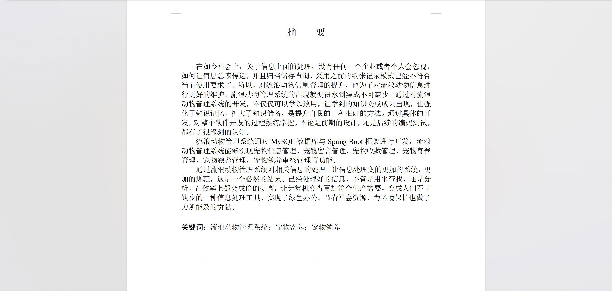

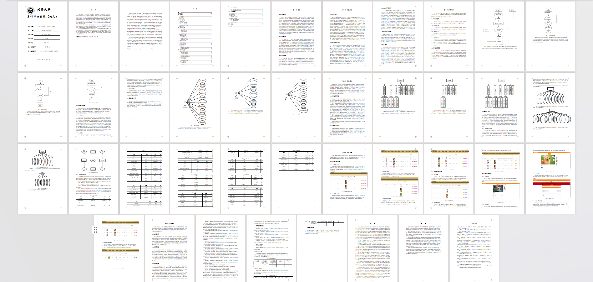

## 系统截图

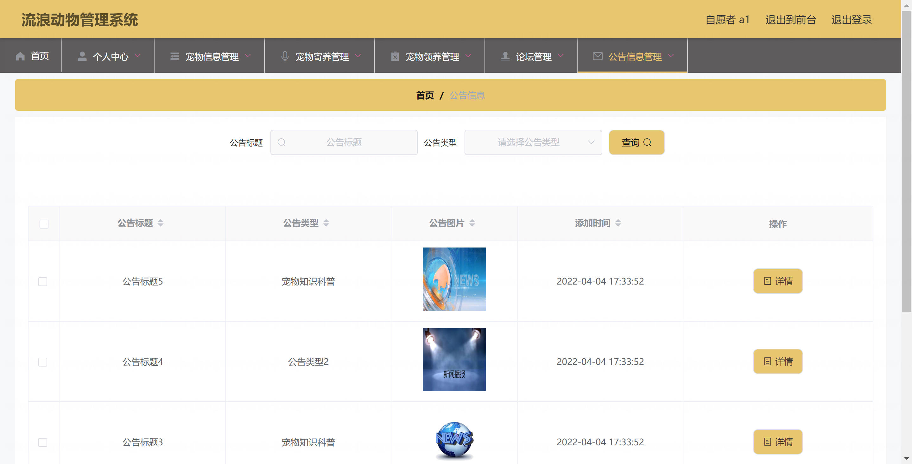

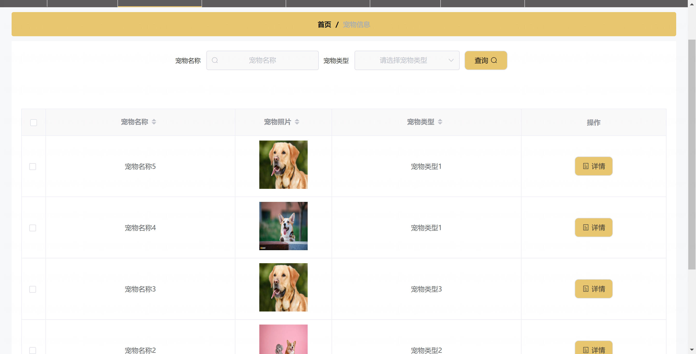

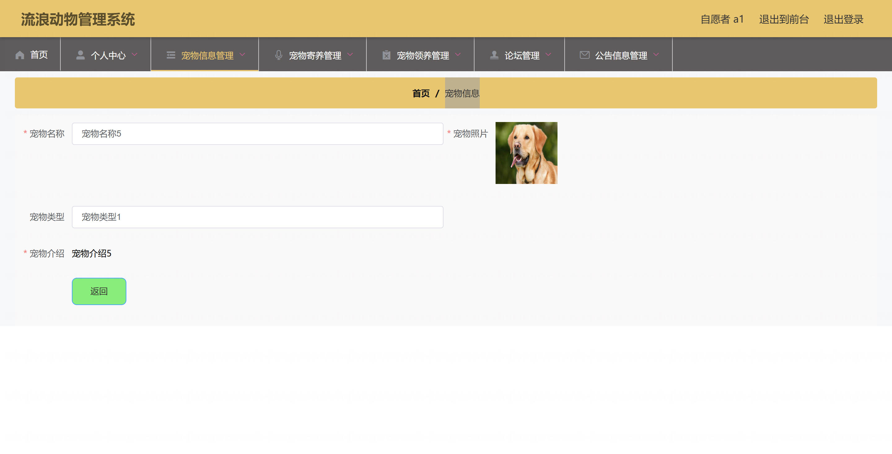

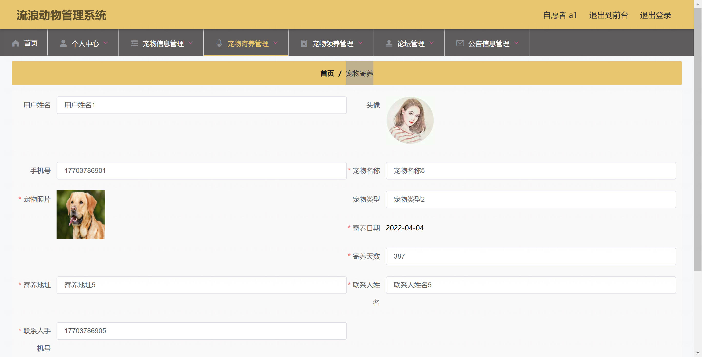

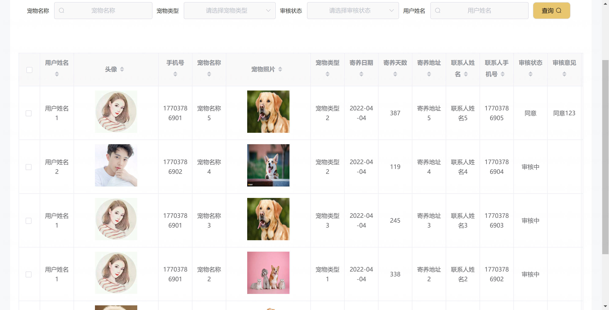

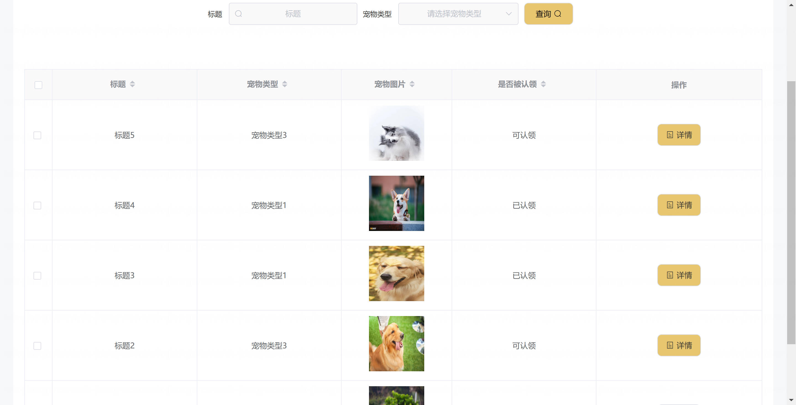

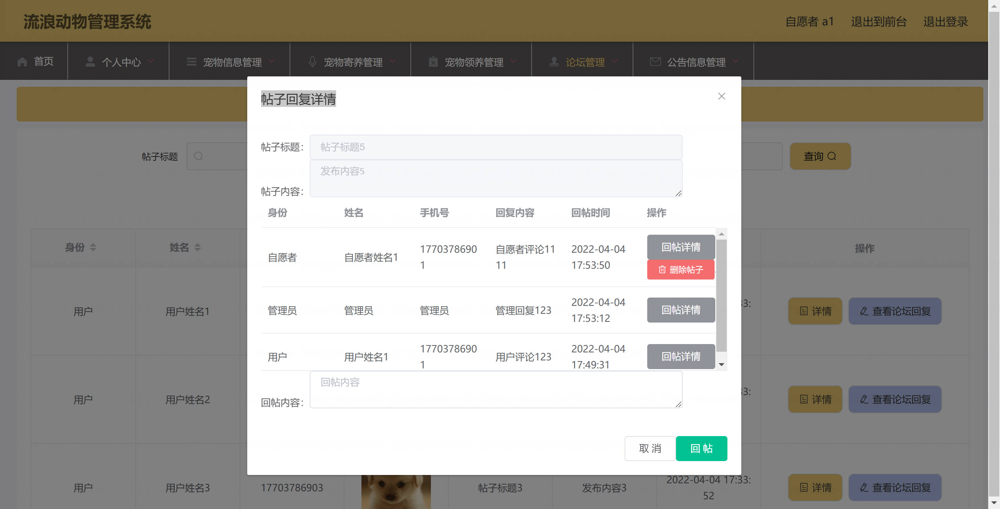

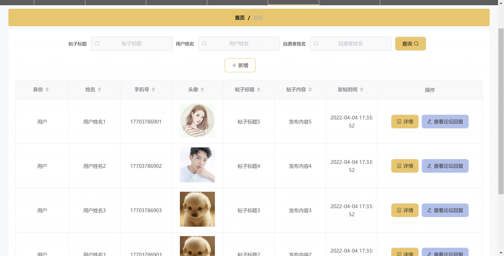

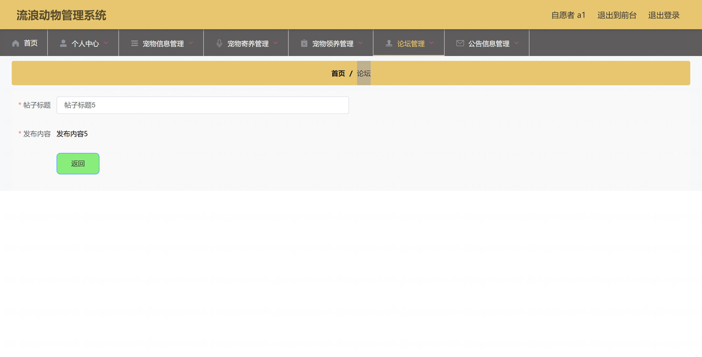
